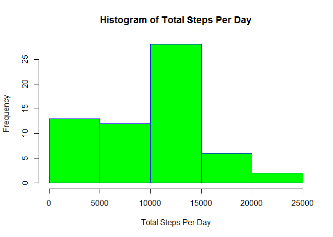
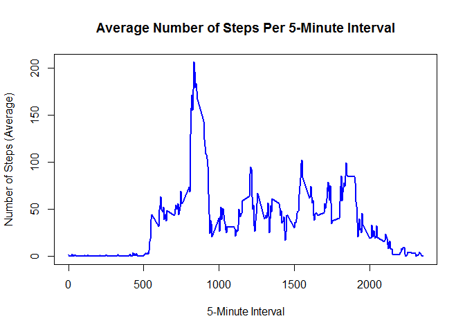
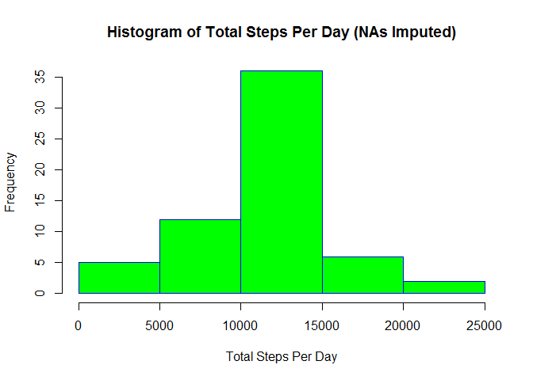
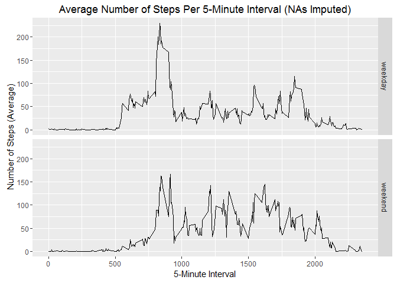

# Reproducible Research: Peer Assessment 1


## Loading and preprocessing the data
**Instructions: **  
Show any code that is needed to:  
1. Load the data (i.e. read.csv())  
2. Process/transform the data (if necessary) into a format suitable for your
analysis  


```r
### Loading and preprocessing the data

# if file is from github, it will have zipped name of 'activity.zip'
# if file is from web, zipped name will be 'repdata%2Fdata%2Factivity.zip'

# See if data file is in working directory.  If not, get it
if(!file.exists("activity.zip")) {
    # see if download data (not from github) is there
    if(!file.exists("repdata%2Fdata%2Factivity.zip")) {
        # Neither file in working directory, download data
        fileURL <- "https://d396qusza40orc.cloudfront.net/repdata%2Fdata%2Factivity.zip"
        download.file(fileURL, "activity.zip")
    } else {
        #downloaded file is there, rename
        file.rename("repdata%2Fdata%2Factivity.zip", "activity.zip")
    }
# extract
unzip("activity.zip")
}


# See if data read into R.  If not, read it.
if(!exists('activity')){
    # set up column classes
    classes <- c('numeric', 'Date', 'numeric')
    # read data
    activity <- read.csv("activity.csv", na.strings = "NA", colClasses = classes)
}

# check activity - 17568 observations of 3 variables
```


## What is mean total number of steps taken per day?
**Instructions: **   
For this part of the assignment, you can ignore the missing values in the dataset.  
1. Make a histogram of the total number of steps taken each day  


```r
# First make a dataset of the total steps per day
dailysteps <- aggregate(x=activity$steps, by=list(activity$date), FUN=sum,
                        na.rm=TRUE)
# dailysteps has 61 obs of 2 variables

# Then make a histogram of the total steps each day
hist(dailysteps$x,
     main="Histogram of Total Steps Per Day",
     xlab="Total Steps Per Day",
     ylab = "Frequency",
     border="blue",
     col="green")
```

<!-- -->


2. Calculate and report the mean and median total number of steps taken per day  


```r
# I interpreted this request as finding the mean and median of the total steps
# a day calculated in part 1.  This continues to explore the question of how
# many steps this subject took each day.

meansteps <- mean(dailysteps$x, na.rm = TRUE)         #9354.23, when rounded
mediansteps <- median(dailysteps$x, na.rm = TRUE)     #10395

# Display in Rmd as
# The mean of the total number of steps taken per day is 
# **`r format(round(meansteps, 2), nsmall = 2)`**. 
# The median of the total number of steps taken per day is 
# **`r format(round(mediansteps, 2), nsmall = 2)`**. 
```

The mean of the total number of steps taken per day is 
**9354.23**.  
  
The median of the total number of steps taken per day is 
**10395.00**.  
  
## What is the average daily activity pattern?
**Instructions: **  
1. Make a time series plot (i.e. type = "l") of the 5-minute interval (x-axis)   
and the average number of steps taken, averaged across all days (y-axis)  


```r
# Set up data: Find average number of steps for every 5-minute interval
intervalsteps <- aggregate(x=activity$steps, by=list(activity$interval),
                           FUN=mean,na.rm=TRUE)
# intervalsteps has 288 obs of 2 variables

# Plot using Base package
plot(intervalsteps$Group.1,
     intervalsteps$x,
     type="l",
     main="Average Number of Steps Per 5-Minute Interval",
     xlab="5-Minute Interval",
     ylab= "Number of Steps (Average)",
     col="blue",
     lwd=2)
```

<!-- -->

2. Which 5-minute interval, on average across all the days in the dataset,   
contains the maximum number of steps?


```r
# Use which.max to return the row index of the highest average step count
# Then subset the data frame to return the 5-minute interval for that
# measurement
maxinterval <- intervalsteps[which.max(intervalsteps$x),1]

# Display in Rmd as
# The 5-minute interval that, on average across all the days in the dataset,
# contains the maximum number of steps is
# **`r maxinterval`** with **`r max(intervalsteps$x)`** steps.
```

The 5-minute interval that, on average across all the days in the dataset,  
contains the maximum number of steps is
**835** with **206.1698113** steps.


## Imputing missing values
**Instructions: **  
Note that there are a number of days/intervals where there are missing values  
(coded as NA). The presence of missing days may introduce bias into some  
calculations or summaries of the data.  

1. Calculate and report the total number of missing values in the dataset (i.e.  
the total number of rows with NAs)  

```r
# Count the number of NAs in the 'steps' variable
# (I used the same formula to ensure there were no NAs in the interval or date
# variables)
NAcount <- sum(is.na(activity$steps))

# Display in Rmd as
# There are **`r NAcount`** missing values in the dataset.
```

There are **2304** missing values in the dataset.  
  
2. Devise a strategy for filling in all of the missing values in the dataset.  
The strategy does not need to be sophisticated. For example, you could use the  
mean/median for that day, or the mean for that 5-minute interval, etc.  


```r
# NAs appear to be mostly in full-day amounts as you might see if someone forgot
# to wear their tracker or the tracker battery died.  Calculating a daily mean or
# median would result in additional NAs or 0s if NA was imputed to 0.

# I chose to remove the NA values and find the mean for the 5-minute interval
# for the remaining data (we already did this in step 1 of the Daily Activity
# Pattern exercise)

# Set up data: Find average number of steps for every 5-minute interval
intervalsteps <- aggregate(x=activity$steps, by=list(activity$interval),
                           FUN=mean,na.rm=TRUE)
# intervalsteps has 288 obs of 2 variables
```


3. Create a new dataset that is equal to the original dataset but with the  
missing data filled in.  


```r
# merge the average steps per interval dataset with the existing activity
# dataset
activity2 <- merge(x=activity, y=intervalsteps, by.x = "interval",
                   by.y = "Group.1")
# activity2 dataset has a column named x with the average steps per interval

# if a row in activity2 has NA steps, fill in the mean steps for that interval
activity3 <-
    within(activity2, steps <-
               ifelse(is.na(steps), x, steps))
```


4. Make a histogram of the total number of steps taken each day and Calculate   
and report the mean and median total number of steps taken per day. Do these  
values differ from the estimates from the first part of the assignment? What is  
the impact of imputing missing data on the estimates of the total daily number  
of steps?


```r
# add up the new number of steps per day
dailysteps2 <- aggregate(x=activity3$steps, by=list(activity3$date), FUN=sum,
                        na.rm=TRUE)

# and make new histogram
hist(dailysteps2$x,
     main="Histogram of Total Steps Per Day (NAs Imputed)",
     xlab="Total Steps Per Day",
     ylab = "Frequency",
     border="blue",
     col="green")
```

<!-- -->


```r
# Calculate mean and median of new daily totals
meansteps2 <- mean(dailysteps2$x, na.rm = TRUE)         #10766.19
mediansteps2 <- median(dailysteps2$x, na.rm = TRUE)     #10766.19

# Display in Rmd as
# The mean of the total number of steps taken per day is
# **`r format(round(meansteps2, 2), nsmall = 2)`**.
# The median of the total number of steps taken per day is
# **`r format(round(mediansteps2, 2), nsmall = 2)`**.
```
The mean of the total number of steps taken per day is 
**10766.19**.  
The median of the total number of steps taken per day is
**10766.19**.


### Answer question: 
* The mean and median for data with imputed values differs from the values
calculated by excluding NAs.   
* The mean number of steps a day inceased from 9354.23 to 10766.19 with imputed
values.   
* The median number of steps a day also increased from 10395 to 10766.19.  
* Interestingly the mean and median are equal with the imputed values.   


## Are there differences in activity patterns between weekdays and weekends?
**Instructions: **  
For this part the weekdays() function may be of some help here. Use the dataset  
with the filled-in missing values for this part.  
  
Create a new factor variable in the dataset with two levels -- "weekday" and  
"weekend" indicating whether a given date is a weekday or weekend day.  


```r
# First, set up dataframe with days of week and if they are a weekday or weekend
day <- c("Mon", "Tue", "Wed", "Thu", "Fri", "Sat", "Sun")
wknd <- c("weekday", "weekday", "weekday", "weekday", "weekday", "weekend",
          "weekend")
df.wknd <- as.data.frame(cbind(day, wknd), stringsAsFactors = TRUE)

# Using dataframe with imputed values, add a variable with the day of week
activity3$day <- weekdays(activity3$date, abbreviate=TRUE)

# Merge activity3 and df.wknd on day to add the "weekend/ weekday" variable
activity4 <- merge(activity3, df.wknd, by = "day")
```

Make a panel plot containing a time series plot (i.e. type = "l") of the 5-minute  
interval (x-axis) and the average number of steps taken, averaged across all  
weekday days or weekend days (y-axis). 


```r
# 5-minute interval mean with wknd
intervalsteps2 <- aggregate(x=activity4$steps,
                            by=list(activity4$interval, activity4$wknd),
                            FUN=mean,na.rm=TRUE)

# plot
library(ggplot2)
plot <- qplot(Group.1, x, data = intervalsteps2,
              facets = Group.2 ~ .,
              geom = "line",
              main = "Average Number of Steps Per 5-Minute Interval (NAs Imputed)",
              xlab = "5-Minute Interval",
              ylab= "Number of Steps (Average)")
plot
```

<!-- -->

### Answer Question:
On average, slight variations in the pattern of steps between a weekday and
weekend can be seen.  
* On weekdays, the volunteer begins taking steps earlier, 
just past the 500 minute increment, wheras on weekends the volunteer does not
pass an average of 50 steps in an increment until past the 750 minute mark.  
* On weekdays the average number of steps peaks at over 225 per increment, on
weekends the max is lower, at about 160 steps per increment.  
* On weekends the volunteer takes more steps throughout the day with a higher 
sum of steps (10255 on weekdays vs 12201 on weekends).
